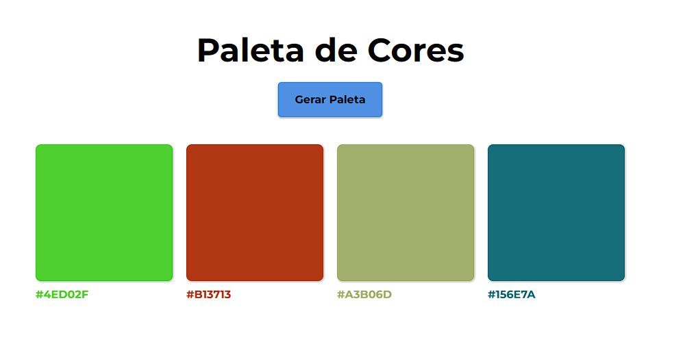

  

## Projeto Gerador de Cores - 🎨
Projeto Gerador de Cores, gera uma paleta de 4 cores ao clique do botão "Gerar Paleta", e Tbm com a funcionalidade de copiar a cor em Hexadecimal. Projeto totalmente responsivo e feito para treinar HTML CSS e JavaScript.

## Tecnologias - 👨‍💻
- HTML 
- CSS
- JavaScript
- Git e Github